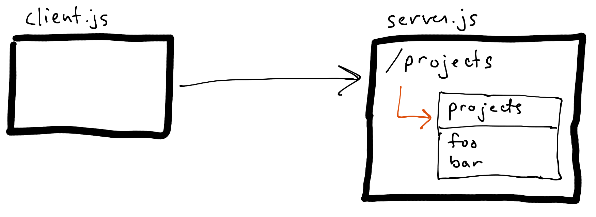

# Chapter 1:  Simple Resource Server

Our story begins like many applications do: with a small company. **Example, Inc**. provides project management services for other small businesses. They've only been in business themselves for a short time and have just a handful of projects and just one actual project manager: **Julie**. So she can easily see all the projects she’s working on, Julie decides to create an internal website that she and other employees can use to view the current list of projects. The website uses no access control since she currently manages all the projects.

While we just explained that Julie has built a website, the sample application in our story is going to actually start off as a simple command line program. This will be our first [client](../terms.md#client). And instead of a web browser calling a web server that returns HTML, our client is going to call an HTTP REST service. This service will be what's known as the [resource server](../terms.md#resource-server), and it will return the project list [resource](../terms.md#resource) in JSON format:



We’re using Node.js and JavaScript to build our example, and for now we just have a simple [server.js](./server.js) as the resource server and [client.js](./client.js) as the client. The server loads the list of projects via a local [projects.json](./projects.json) file.

We can start the Resource Server:

```sh
$ node server.js
Resource Server listening on port 5000
```

and run the client, which calls the server to fetch the projects, displays them, and exits:

```sh
$ node client.js
Projects:
 [ { name: 'Foo, Inc.' }, { name: 'Bar, Inc.' } ]
```

## Next

[Chapter 2: More Than One User](../02-more-than-one-user)
