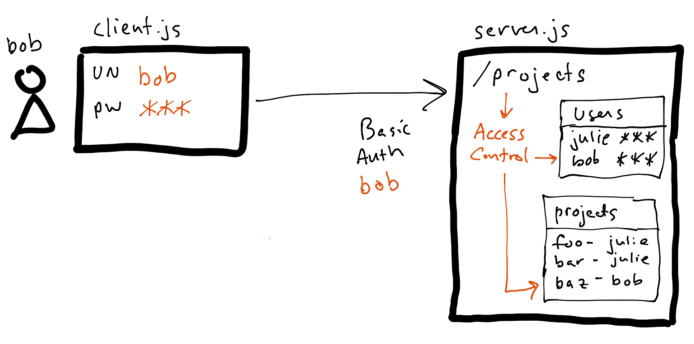

# Chapter 2: More Than One User

Business at Example Inc. has picked up! There are now more projects than Julie can handle on her own, so the owners decide to hire another project manager: **Bob**. And with more than one PM managing projects, Julie’s simple project list application needs to change as well, so that she and Bob can manage their own projects. 



To implement this in a simple way, Julie modifies [server.js](./server.js) to require that the client pass user credentials (username/password) via HTTP [Basic Authentication](https://tools.ietf.org/html/rfc7617). Her new logic then validates the credentials against a local [users.json](./users.json) file and returns only the projects owned by the validated user.

> Pretend for now (for the sake of simplicity) that the passwords in the `users.json` file are hashed and salted instead of stored in clear text.

Now when the [old client](../01-a-simple-client-and-resource-server/client.js) attempts to access the list of projects, an error is returned since the client is doing nothing to satisfy the server's new requirements:

```sh
$ node client.js
ERROR: 401 - "Authenticaion required!"
```

The new [client.js](./client.js) therefore needs to be modified to collect user credentials before making the call to the resource server. Julie makes this change and now Bob is able to fetch only his projects:

```sh
$ node client.js
Username: bob
Password:
Projects:
 [ { name: 'Baz, Inc.', owner: 'bob' } ]
```

## Access Control, Authorization, and Authentication

What Julie has actually implemented in her application is [access control](../terms.md#access-control). Her resource server no longer just serves up data to anything that requests it. Instead it controls access by employing [authorization](../terms.md#authorization) to verify that the current request has proper permissions. 

This is done by:

* Requiring that the request contain a valid `Authorization` request header per the HTTP Basic Authentication specification.
* Using [authentication](../terms.md#authentication) to verify that the credentials contained in the `Authorization` header match someone in a known list of users.
* Filtering the resulting resource to only contain projects owned by the authenticated user. This too is a form of authorization. You may have noticed that we actually have a third user (`sam`) in the [user store](./users.json). If you use his credentials with the client, the server will return a successful result, but it will be an empty project list. This is because `sam` doesn't own any projects yet.

All of the authorization rules together (including authentication) make up an [authorization policy](../terms.md#authorization-policy). 

Currently all access control, the authorization it depends on, and the policies that drive it are all embedded in the resource server. Coming up in the story Julie will find the need to decouple and externalize some of these capabilities as Example, Inc. continues to grow.
